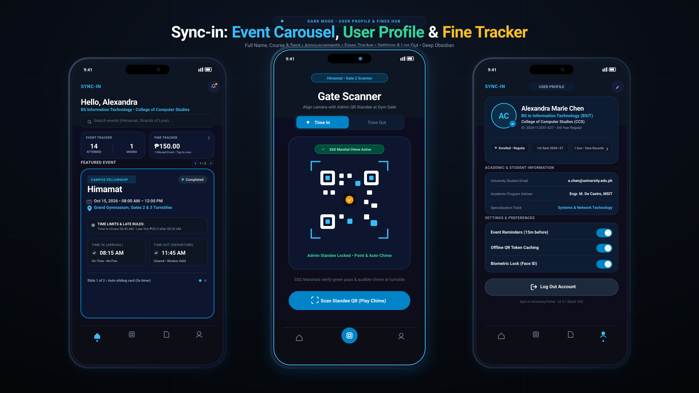

# Sync-in: University Events & Activities Attendance Ecosystem

<p align="center">
  
</p>

<p align="center">
  <a href="https://github.com/"></a>
  <a href="#"></a>
  <a href="LICENSE"></a>
  <a href="https://nodejs.org/"></a>
  <a href="Dockerfile"></a>
  <a href="SECURITY.md"></a>
  <a href="SECURITY.md"></a>
</p>

<p align="center">
  <b>Sync-in</b> is a high-efficiency campus activities attendance platform engineered for university events (specifically featuring <b>Himamat</b> and <b>Strands of Love</b>), student assemblies, and volunteer drives. Incorporates dual <b>Time In</b> and <b>Time Out</b> checkpoints, zero-trust RBAC, rolling cryptographic QR passes, and physical RFID tap fallback.
</p>

<p align="center">
  <a href="#-quick-start">Quick Start</a> •
  <a href="#-role-ergonomics--device-compatibility">Role Ergonomics</a> •
  <a href="#-security-architecture">Cybersecurity</a> •
  <a href="#-deployment-guide">Deploy</a> •
  <a href="#-api-endpoints">API</a> •
  <a href="CONTRIBUTING.md">Contributing</a>
</p>

---

## ⚡ 1-Click Cloud Deployments

Deploy your own instance of Sync-in instantly:

[](https://vercel.com/new)
[](https://app.netlify.com/start/deploy)
[](https://pages.github.com/)

---

## 🚀 Quick Start

Sync-in requires **zero build steps** and **zero npm dependencies**. Run it directly using Node.js, Docker, or open `index.html` in your browser.

### Option A: Node.js Built-in Server
```bash
# Clone the repository
git clone https://github.com/<YOUR-USERNAME>/sync-in.git
cd sync-in

# Run immediately (Zero npm install needed)
node server.js
```
* **Local Web App**: Open [http://localhost:3000](http://localhost:3000)
* **REST Health Check**: [http://localhost:3000/api/health](http://localhost:3000/api/health)

### Option B: Docker Container
```bash
# Run with Docker Compose
docker compose up -d

# Or with Docker CLI
docker build -t sync-in .
docker run -p 3000:3000 sync-in
```

### Option C: Direct Browser / Static Hosting
Double-click `index.html` or serve with any static web server:
```bash
python -m http.server 3000
```

---

## 📱 Role Ergonomics & Device Compatibility

The system dynamically adapts its layouts, touch targets, and data density according to each role's physical environment:

```
┌────────────────────────────────────────────────────────────────────────────────────────┐
│                        ROLE & DEVICE ERGONOMICS MATRIX                                │
├────────────────────────┬─────────────────────────────┬─────────────────────────────────┤
│ Role                   │ Primary Target Device       │ UX & Ergonomic Adaptations      │
├────────────────────────┼─────────────────────────────┼─────────────────────────────────┤
│ **Student (User)**     │ **Smartphones**             │ • Edge-to-edge fluid viewport   │
│                        │ *(Also Tablet & Laptop)*    │ • 48px touch navigation bar     │
│                        │                             │ • Single-screen focus on mobile │
│                        │                             │ • Dual-pane layout on tablets   │
│                        │                             │ • Tri-screen mode on laptops    │
├────────────────────────┼─────────────────────────────┼─────────────────────────────────┤
│ **Faculty (Teacher)**  │ **Tablets (iPad) & Laptops**│ • Horizontal touch course tabs  │
│                        │                             │ • 52px touch-safe roster rows   │
│                        │                             │ • Instant CSV export toolbar    │
│                        │                             │ • Smooth scrollable data tables │
├────────────────────────┼─────────────────────────────┼─────────────────────────────────┤
│ **SSG Admin Command**  │ **Tablet Standees & Laptops**│ • Turnstile RFID Kiosk layout   │
│                        │                             │ • Big 52px marshal touch targets│
│                        │                             │ • Multi-column telemetry grid   │
│                        │                             │ • Touch-safe crisis broadcast   │
└────────────────────────┴─────────────────────────────┴─────────────────────────────────┘
```

### 1. Student Mobile Application
* **Mobile Phones (`< 768px`)**: Single-screen native web app with an anchored 48px bottom navigation bar (`Events`, `Scanner`, `Records`, `Profile`).
* **Tablets (`768px – 1024px`)**: iPad Dual-Pane Mode presenting the Event Countdown & Sweat Equity Tracker on the left and Checkpoint Pass on the right.
* **Laptops / Computers (`> 1024px`)**: Panoramic Tri-View Showcase showing all 3 screens simultaneously.

### 2. Faculty Portal (Tablets & Laptops)
* Designed for classroom and hall registration desks.
* Horizontal touch-scrollable course section tabs (`IT 301A`, `CS 202`, `IT 101`).
* 52px touch-safe roster rows with "Excuse for Project / Revoke" toggles.
* One-click gradebook CSV export with spreadsheet formula injection protection.

### 3. SSG Admin Command Center (Tablet Kiosks & Laptops)
* Engineered for turnstile booth tablets (iPad) and laptop command desks.
* Oversized 50px touch confirmation buttons for rapid turnstile logging.
* **UBYTeS Physical RFID Fallback Reader**: Automatic hardware UID buffer with dual-check confirmation and Philippine Data Privacy Act masking (`04:9A:**:**:B4`).
* Community service slot configurator ("Sweat Equity") and live event voting orchestrator.

---

## 🔒 Security Architecture & Threat Defense

Sync-in features an enterprise-grade **Zero-Trust Defense-in-Depth Subsystem (`SecurityCore`)**:

| Defense Layer | Threat Addressed | Mechanism & Implementation |
| :--- | :--- | :--- |
| **Content Security Policy (CSP)** | Script Injection & Clickjacking | Restrictive CSP meta header, `X-Frame-Options: SAMEORIGIN`, `X-Content-Type-Options: nosniff`. |
| **XSS & DOM Sanitizer** | Stored & DOM XSS (OWASP A03) | `SecurityCore.sanitizeHTML()` neutralizes `<script>`, `<iframe>`, javascript URIs, and event handlers. |
| **Cryptographic Rolling Tokens** | QR Replay & Screenshot Proxy (OWASP A07) | 15-second epoch window bound to `HMAC-SHA256(studentId + eventId + epoch + nonce, serverSecret)`. |
| **Anti-Replay Sentinel** | Duplicate Pass Scans | Gate-side in-memory consumed nonce ledger. Rejects duplicate screenshot presentations with `409 Conflict: Replay Attack Prevented`. |
| **Zero-Trust RBAC Sentinel** | Privilege Escalation (OWASP A01) | Role switching requires administrative Master Key PIN challenge (**Demo PIN: `SSG-2026`**). Direct DevTools console execution blocked. |
| **UBYTeS RFID Rate Limiter** | Flipper Zero NFC Hammering (CWE-799) | ISO 14443-A hex regex validator, 1.2s tap cooldown, and 10s hardware lockout upon 3 rapid invalid scans. UIDs masked per RA 10173. |
| **CSV Formula Injection Guard** | Spreadsheet DDE Execution (CWE-1236) | Neutralizes `=`, `+`, `-`, `@`, `\t` prefixes with prepended apostrophes prior to exporting roster CSVs. |
| **Blockchain Audit Ledger** | Log Tampering & Repudiation | Cryptographically chained SHA-256 blocks tracking all check-ins, votes, appeals, and crisis drills. |

---

## 📡 Built-In REST API Endpoints

The included `server.js` provides lightweight REST endpoints for mobile apps and turnstile hardware:

* `GET /api/health` — Service health status, uptime, and shield metrics.
* `POST /api/checkin` — Checkpoint attendance verification and ledger signing.
* `POST /api/rfid/tap` — ISO 14443-A card UID validation with RA 10173 privacy masking.
* `GET /api/audit-ledger` — Retrieves the immutable SHA-256 blockchain audit trail.

---

## 📁 Repository Structure

```
sync-in/
├── .github/
│   ├── workflows/
│   │   ├── deploy-pages.yml   # Automated GitHub Pages CI/CD
│   │   └── ci.yml             # Quality assurance & Docker build tests
│   ├── ISSUE_TEMPLATE/        # Standardized GitHub issue templates
│   └── PULL_REQUEST_TEMPLATE.md
├── docs/                      # Visual presentation mockups & SDLC diagrams
├── public/                    # Production web assets & favicon
├── index.html                 # Standalone web application entry point
├── server.js                  # Production zero-dependency Node.js HTTP server
├── package.json               # Node.js configuration & scripts
├── Dockerfile                 # Multi-stage production container
├── docker-compose.yml         # Container orchestration
├── vercel.json                # Vercel deployment configuration
├── netlify.toml               # Netlify deployment configuration
├── LICENSE                    # MIT License
├── SECURITY.md                # Security policy & vulnerability reporting
├── CONTRIBUTING.md            # Contribution guidelines
└── README.md                  # Project documentation
```

---

## 📄 License

This project is licensed under the [MIT License](LICENSE).
